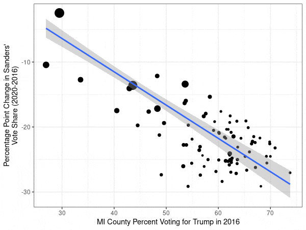

*Graduate course 研究生课程 · Tsinghua 70700173 · Compulsory for Political Science 政治学专业基础课*

*Tsinghua Quality Course 清华大学精品课*

Analysis of Political Data is the gateway course of political methodology at Tsinghua, and it assumes no background in statistics or mathematics. The course equips students with one toolkit, running from univariate description to multivariate regression, and it insists throughout that a student understand why a method works before running it.

The first half covers the foundations: probability, distributions, sampling, confidence intervals, and hypothesis testing. The second half turns to the classical linear regression model and its assumptions, then to what happens when those assumptions fail, through omitted variables, multicollinearity, heteroskedasticity, autocorrelation, and endogeneity. Later weeks reach moderation, missing data, limited dependent variables, and latent variables. Students implement all of it in R. From the ninth week the lab passes to the students themselves, who take turns presenting a technique and setting an exercise for their classmates.

A student who finishes the course can read the methods section of a quantitative article, in Chinese or in English, without stumbling, and can defend the choices made in their own work.

《治理技术专题：政治数据分析》(70700173) 是政治学专业基础课，定位于科学研究方法入门，不要求学生有任何统计学或数学基础。课程为学生配备一套从单变量描述统计到多变量非线性回归的完整工具箱，剖析大样本分析的规范逻辑、流程与术语，目标是让学生阅读中英文方法论文献时不再有障碍。

课程前半段讲授概率、分布、抽样、置信区间与假设检验等基础，后半段转入经典线性回归模型及其假定，逐一处理遗漏变量、多重共线性、异方差、自相关与内生性等假定失效时的后果与补救，并延伸至调节效应、缺失值、受限因变量与潜在变量。操作层面全部基于R语言实现。自第九周起，实验环节交由学生主讲。这样安排的用意不只在教会语法，更在于让学生掌握自行解决“射程以外”问题、寻找优质资源的本领。

课程绰号“大样本分析与列文虎克”，受[一位B站Up主](https://space.bilibili.com/195312946/favlist?fid=941316546&ftype=create)的哈利波特系列节目启发。它标明了本课与一般方法应用课程的分野：不采用“代码+案例”的教学方式，而是一步步挖掘、验证、辟谣大样本分析中那些广为人知或鲜为人知的细节与精妙之处。

已修读过本科或研究生阶段计量经济学、社会科学方法类课程的学生，不必选择本课。

### Course Materials 课程材料

[Lecture slides, week by week 全部课件（按周）](https://www.drhuyue.site/slides_gh/slides/courses/analysisOfPoliticalData/)
