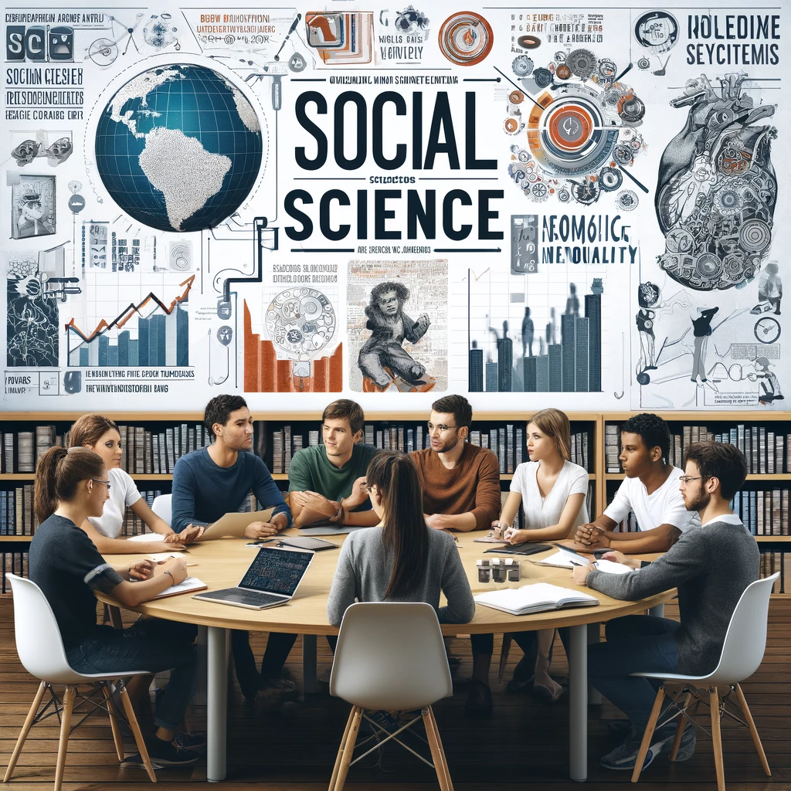

The Seminar aims to deepen students' grasp of social science research's professional aspects and boost their academic and professional competitiveness. 
The curriculum bifurcates into guiding dissertation development and enhancing personal ability demonstration in professional contexts, with a strong focus on political science for case studies. 
This compulsory course for political science graduate students also welcomes other social sciences, promoting interdisciplinary synergy to foster talents for the interdisciplinary-AI era.

The course combines theoretical seminars with practical exercises. 
It's designed to refine critical thinking, academic articulation, and broaden international and domestic disciplinary insights, preparing students as high-caliber professionals for the new era.

《社会科学专业化与能力提升研讨课》旨在加深学生对社会科学**学术研究专业性**的理解，并提升他们在**学术与职场中的竞争力**。课程分为两大核心部分：一是指导学生如何规划、发展，并圆满完成学位论文；二是提高学生在职业及学术场合展示个人能力的技巧。

以政治学为主要内容和案例分析的基础，本课程不仅是政治学专业研究生的必修课，同时也向其他社会科学学科开放，强调学科间的共性与交叉融合，目的是培育符合新时代要求的“新文科”人才。

