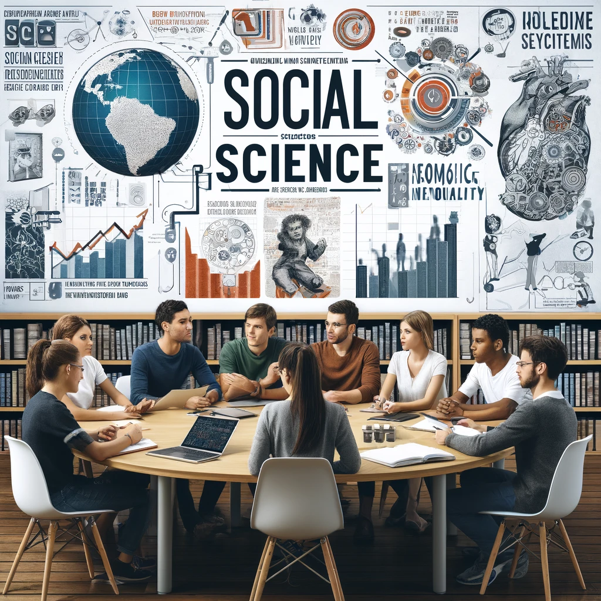

*Graduate seminar 研究生研讨课 · Eight weeks 八周 · Compulsory for Political Science doctoral students 政治学专业博士生必修*

Large language models have already rewritten how researchers find literature, analyze data, and draft prose. The question is no longer whether to use them but where they belong, and where they do not. This seminar takes that question as its organizing problem, alongside the older one it cannot replace: what makes a piece of social science research professional.

The course runs on the student's own work. In the first week each participant submits an unpublished paper they wrote or led, and that paper is the term's target. The seminar then walks through the core sections of a dissertation. Students choose a published article by their own advisor as a model, use AI to extract its argumentative skeleton, verify that extraction by hand, have the model reconstruct the introduction, literature review, and conclusion in turn, and then compare the result against the original. What the comparison exposes is the point of the exercise. Each student afterwards rewrites the corresponding section of their own paper, and from the seventh week reviewers are assigned at random to read a classmate's revision in the role of Reviewer 2.

Two habits are what a student should leave with. The first is the ability to tell writing that is finished from writing that is good. The second is a clear division of labor with the machine, knowing which tasks it can accelerate and which collapse if delegated. Doctoral students in political science are advised to take the seminar after passing the dissertation proposal defense. Laptops, tablets, and phones stay closed in class.

《社会科学专业化与能力提升研讨课》从一个已经无法回避的问题出发：大语言模型重塑了文献检索、数据分析与学术写作的流程，研究者应当在哪些环节拥抱技术红利，又必须在哪些环节守住学术规范的底线。课程同时处理一个更早也更根本的问题，即社会科学研究的专业性究竟由什么构成。

课程以学生自己的作品为轴线展开。第一周，每位同学提交一篇由本人独立或主导完成、尚未发表的学术文章，这就是本学期的工作目标。随后课程围绕学位论文的核心环节推进：学生选定一篇导师正式发表的文章作为仿写对象，先用AI提炼其核心论点与逻辑结构并人工校验其可靠性，再让AI依次补全导言、文献综述与结论，最后与原文逐一比对。比对暴露出来的落差，正是这门课要讲的内容。此后学生运用课上工具系统改写自己文章的对应部分。自第七周起，课程随机分配评审人，以Reviewer 2的身份对同学上周的改写稿提出评议。

课程希望学生带走两种习惯。其一，能够分辨“写完”与“写好”，识别优秀论文的结构、论证逻辑与学术语言。其二，在选题、文献梳理、写作与修改各环节中合理划分人与AI的分工，明确哪些任务可以借助工具提速，哪些环节一经代劳便告失效。课程以政治学为主要内容与案例基础，同时向其他社会科学学科开放，鼓励跨学科对话与方法借鉴。建议政治学专业博士研究生在通过开题答辩后选修，不建议硕士生选修。课上禁止使用电脑、平板与手机。

### Course Materials 课程材料

[Lecture slides 课件](https://www.drhuyue.site/slides_gh/slides/courses/professionalism/)
