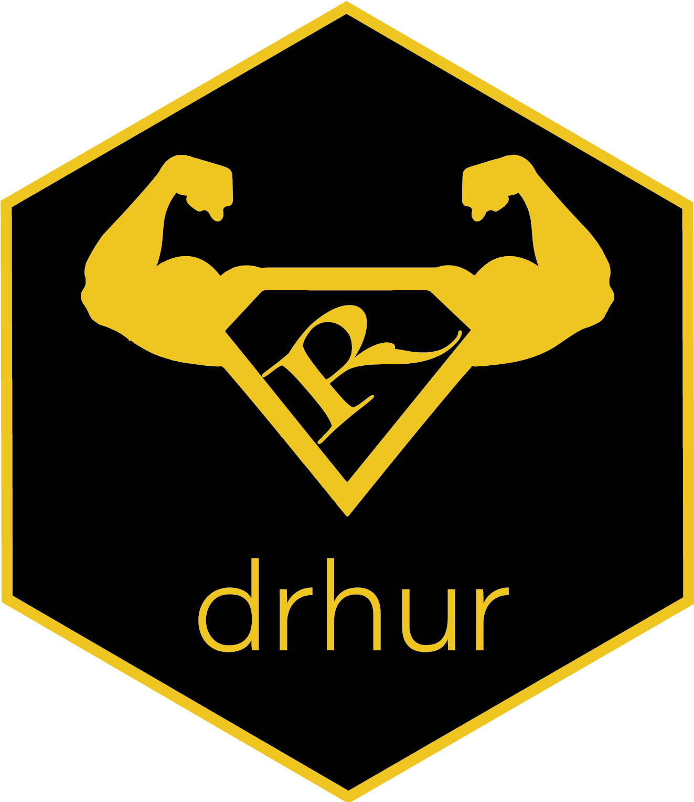

*Open workshop series 公开工作坊 · Year-long 一年期 · Free to attend 免费开放*

I created the *Learning R with Dr. Hu and His Friends* workshop series so that students with no programming background could enjoy the convenience and efficiency that programming brings to academic life. The series runs eighteen episodes, from fundamental data cleaning through to Bayesian analysis and machine learning. It is a year-long program, free to the whole Tsinghua community offline and to everyone else online.

I also built the R package `drhur` to support the lectures and the practice that follows them. You can find out how to install and use it on [its page here](/software/drhur) or on [its own website](https://sammo3182.github.io/drhur/). The workshop series is the core component of the certificate program "Young Computational Social Scientist: R Language Programmer," granted by the Tsinghua Computational Social Science Platform.

我创立R语言工作坊，是希望没有编程基础的学生也能享受编程（尤其是R语言编程）为其学业和研究带来的助益。全系列共十八节课，覆盖从基础数据清理到贝叶斯分析、机器学习等各个编程应用领域。工作坊为一年期项目，线下免费向清华全体学生和教职工开放，并根据需求提供线上模式。

我同时开发了开源软件包`drhur`辅助教学与课后练习，详情可参见“软件”部分的[详细介绍](/software/drhur)或[软件网站](https://sammo3182.github.io/drhur/)。R语言工作坊是“计算社会科学编程语言证书项目”的核心部分，该证书由清华大学计算社会科学平台颁发。

### Course Materials 课程材料

[Workshop slides 工作坊课件](https://www.drhuyue.site/slides_gh/slides/courses/rWorkshop/)

Preview slides for the lectures are also available from the R package [`drhur`](https://sammo3182.github.io/drhur/).
