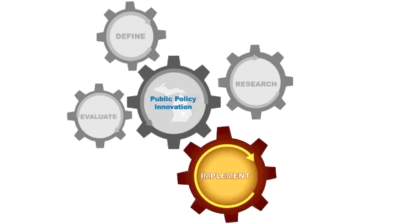

*Major course 政治学与行政学专业课 · Tsinghua 30700953 · Not currently offered 暂未开设*

Analysis of Public Policy focuses on empirical policy evaluation. The course brings a political scientist's view and a set of modern empirical methods to bear on how policies are assessed. Students learn the analytic theories that underpin policy evaluation, and then the tools that put those theories to work, including case study, survey, experiment, and big-data analysis. Every topic carries real cases, so that a student can see where each theory and each method applies.

The first half concentrates on the dominant paradigms and theoretical perspectives in policy analysis. The second turns to method, working through case analysis, survey analysis, experiments, and large-scale data, with attention to the practical craft of each. Teaching runs through interaction rather than lecture alone, on the view that a student understands a concept once they have had to use it.

This is the course for students majoring in Political Science and Public Administration. If you want an introduction to public policy without the disciplinary commitment, take the general education version, ["Understanding Policies" (10700193)](/course/substantive-series/01-understanding_public_policy/).

《公共政策分析：视角与方法》(30700953) 定位于实证分析，讲授基于现代政治科学理论和工具的公共政策分析模式与方法。课程通过讲授、宾主对、实时数据分析等环节，培养学生的社会科学研究素养，以及恰当选择和运用实证方法分析现实政策的能力。

课程前半段集中讲授主流政策分析范式与理论视角，后半段侧重个案分析、调查分析、实验、大数据分析等分析手段及其应用技巧，力图实现政策分析能力在理论与实操两个层面的共同提升。教学以师生互动为核心，在参与式课堂中帮助学生加深对公共政策分析基本概念、理论与思路的理解。

本课为政治学与行政学的专业课程。如你只是对公共政策的基础知识感兴趣，欢迎选修通识版本的[《理解公共政策》(10700193)](/course/substantive-series/01-understanding_public_policy/)。

*本课目前暂未开设。*

### Course Materials 课程材料

[Lecture slides, week by week 全部课件（按周）](https://www.drhuyue.site/slides_gh/slides/courses/analysisOfPublicPolicy/)
