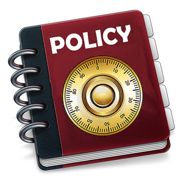

*General education course 通识课程 · Tsinghua 10700193 · No prerequisites 无先修要求*

*Tsinghua Quality Course 清华大学精品课 · Selected for the University's General Education Course Development Program 入选清华大学优质通识课建设计划*

Public policies define the institutional framework of governance and set the rules that shape ordinary life. Understanding Policies equips students to analyze how policies emerge, how they operate, and what consequences they produce. It assumes no prior knowledge of public policy or social science.

The course is built in two halves. The first draws on political science, sociology, psychology, and economics to examine how social scientists explain policy processes, tracing the political bargaining, economic trade-offs, and psychological mechanisms that sit behind a decision. The second opens the analytic toolkit, covering experimental methods, statistical inference, big data techniques, and structured case comparison. Every topic pairs a perspective with a real case, so that the abstraction always lands on a concrete policy.

Students carry one project across the whole term. Each chooses a single public policy connected to their own life or interests, states the research question, assembles an annotated bibliography, presents a plan, and submits a full policy analysis proposal in the final week. Class time opens with a format I call 宾主对: one student presents the week's required reading, two others are drawn at random to challenge it, and the presenter answers back.

Two capacities are what a student should leave with. One is the ability to read a specific policy closely enough to explain why it works the way it does. The other is a feel for the direction in which a system of governance is moving.

公共政策构成国家治理的制度框架，也规定着每位公民日常生活的基本规则。《理解公共政策》(10700193) 帮助学习者理解政策如何产生、如何运行、如何发挥效果，在认识治理逻辑的同时，掌握分析和评估政策的专业能力。本课属通识类课程，不要求任何社会科学或公共管理学基础。

理解政策需要穿透表象。课程前半段以跨越政治、经济、社会、心理的多元学科视角，系统剖析政策制定背后的政治博弈、经济权衡与社会心理机制，帮助学生建立分析政府行为的理论框架。后半段则打开社会科学的分析工具箱，介绍实验方法、统计推断、大数据分析与案例比较，并引入政策文本挖掘与成本效益建模，培养数据驱动的决策思维。每一个专题都配有现实案例，让理论落在具体政策上。

课程要求学生用整个学期完成一份政策分析计划：自选一条与个人生活或志趣相关、已经或正在执行的公共政策，依次提交目标陈述、注释文献、计划宣讲与完整计划书。课堂第一环节为“宾主对”：一位同学主讲当周指定阅读，两位同学随堂抽选进行质询，主讲人当场回应。

课程希望学生获得两种能力：既能贴近地剖析一条具体政策的运行机理，也能把握治理体系演变的宏观趋势。这既关乎公民对公共事务的判断力，也是日后参与治理实践的核心竞争力。

如你需要学习本主题的专业课程，可参考[《公共政策分析》(30700953)](/course/substantive-series/01-analysis_of_public_policy/)。

### Course Materials 课程材料

[Lecture slides, week by week 全部课件（按周）](https://www.drhuyue.site/slides_gh/slides/courses/understandPolicy/)
