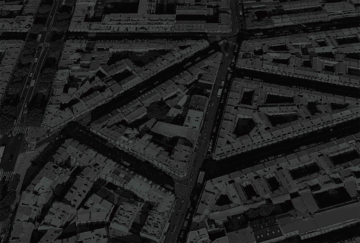

This course concentrates on the dominant force of human modernization---the cities. From  a view of political science, the course discuss the macro and micro politics among heterogeneous cities together with specific topics of urban governance. The course is on building. More information will be available soon.

### Preview Slides

TBA

