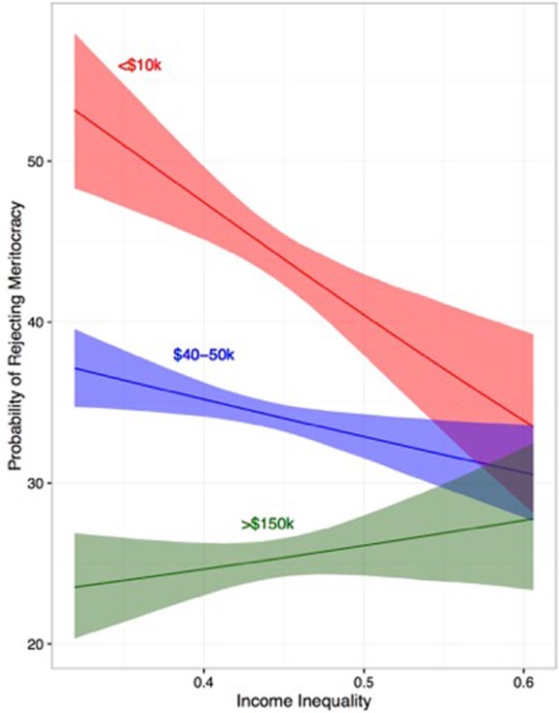

This project delves into socioeconomic disparities, examining the systematic differences in income, assets, mobility, and access to resources among citizens. 
Our team is interested in the impact, pathways, and mechanisms of this structural property on the political decisions and behaviors of individuals and groups. 
Specifically, the project seeks to understand the dimensions of inequality that people recognize and how this recognition influences their political awareness, preferences, and choices. 
Furthermore, it investigates the origins of the public's perceptions of inequality: what---or perhaps *who*---influence these perceptions?

项目“感知不平等”聚焦社会经济不平等问题，尤其是公民在收入、资产、流动性以及资源获取等方面的系统性差异。
项目团队重点关注京极不平等结构性特征对个体和群体政治决策与行为的影响、途径和机制。
尤其是，我们试图理解人们如何识别不平等（他们关注不平等的哪些方面？），以及这种认识和理解如何影响他们的政治认知、偏好和决策。
更进一步，我们探究什么因素——或者说是谁——塑造了大众对不平等的感知。

### Selected Publications 部分成果

Hu, Yue, Shuai Jin, and Tianguang Meng. 2024. “Why Economic Inequality Undermines Political Trust: An Analysis of Mechanisms.” *Public Opinion Quarterly*: Forthcoming. (Pre-print [avaliable here](https://www.researchgate.net/publication/379052870_Why_Economic_Inequality_Undermines_Political_Trust_An_Analysis_of_Mechanisms))

Solt, Frederick, Yue Hu, Kevan Hudson, Jungmin Song, Dong 'Erico' Yu. 2017. [“Economic Inequality and Class Consciousness.”](https://www.journals.uchicago.edu/doi/abs/10.1086/690971) *The Journal of Politics* 79(3): 1079–83.

———. 2016. [“Economic Inequality and Belief in Meritocracy in the United States.”](https://journals.sagepub.com/doi/full/10.1177/2053168016672101) *Research & Politics* 3(4): 1–7.

Tang, Wenfang, Yue Hu, and Shuai Jin. 2016. [“Affirmative Inaction: Language Education and Labor Mobility among China’s Muslim Minorities.”](https://www.tandfonline.com/doi/abs/10.1080/21620555.2016.1202753) *Chinese Sociological Review* 48(4): 346–66.

季程远和胡悦: [《经济发展与纵向获得感》](http://jpa.sysu.edu.cn/docs/20220408160723090197.pdf)，《公共行政评论》2022年 86(2)期，第4–21页。
