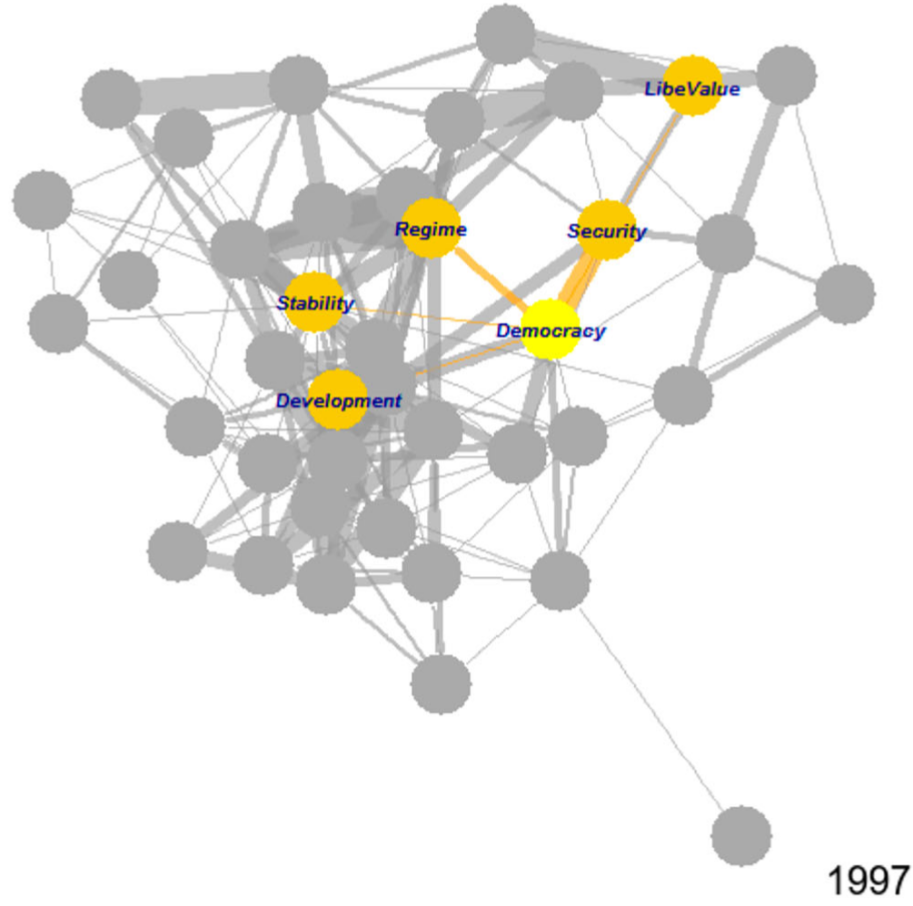

Comparing publics across countries and across decades runs into a hard problem. Surveys ask different questions, in different years, of different people, and the answers do not line up. This project builds measurement models that make those scattered fragments comparable. Drawing on comprehensive collections of survey data and latent-variable models, we generate annual estimates of what publics want and believe, then validate those estimates against evidence the models never saw.

The work runs in two directions. One is constructive: dynamic comparative estimates of political interest, political discontent, and support for gay rights, released as public data for other researchers to use. The other is critical: showing where such measures break down, how far published findings depend on defensible but arbitrary coding decisions, and why a single latent dimension cannot carry the weight recent scholarship has placed on it. Alongside the measurement work, we examine what laboratory experiments and eye-tracking can, and cannot, establish about political behavior.

跨国家、跨年代的民意比较面临一个基础困难：不同国家、不同年份的调查所问并非同一问题，受访的也并非同一群人，答案之间无法直接对齐。本项目致力于构建测量模型，使这些零散的调查证据变得可比。我们汇集全球公共调查数据，通过潜变量模型估计各国民众数十年间的态度变迁，再以模型未曾使用的证据检验估计结果的效度。

项目包含建构与反思两个面向。建构的一面，是产出政治兴趣、政治不满、性少数群体权利支持等议题的动态比较测度，并将数据公开供学界使用。反思的一面，是厘清这类测度的边界：既有研究的结论在多大程度上依赖于合理却任意的编码选择，单一潜变量维度又为何难以承载近年研究赋予它的解释重量。与测量工作并行，我们也考察实验室实验、眼动追踪等方法在政治行为研究中的适用范围与局限。

The software this project produces is documented in the [Software 软件](/software/) section.

本项目开发的开源工具见[软件](/software/)栏目。

### Selected Publications 部分成果

Ma, Haofeng, Jeongho Choi, Yuehong Cassandra Tai, Yue Hu, and Frederick Solt. 2026. [“Macrodiscontent across Countries.”](https://doi.org/10.1017/S1755773926100599) *European Political Science Review*: 1–17.

Hu, Yue, and Frederick Solt. 2025. [“Macrointerest across Countries.”](https://doi.org/10.1017/S0007123424001042) *British Journal of Political Science* 55: e71. (Pre-print [available here](https://fsolt.org/papers/solt2023_pre))

Hu, Yue, Yuehong Cassandra Tai, Hyein Ko, Byung-Deuk Woo, and Frederick Solt. 2025. [“An Incomplete Recipe: One-Dimensional Latent Variables Do Not Capture the Full Flavor of Democratic Support.”](https://doi.org/10.1177/20531680251341857) *Research & Politics* 12(2). (Pre-print [available here](https://fsolt.org/papers/hutaikowoosolt2023_pre))

Hu, Yue, Yuehong Cassandra Tai, and Frederick Solt. 2025. [“Revisiting the Evidence on Thermostatic Response to Democratic Change: Degrees of Democratic Support or Researcher Degrees of Freedom?”](https://doi.org/10.1017/psrm.2024.16) *Political Science Research and Methods* 13(1): 237–43. (Pre-print [available here](https://osf.io/download/qpfsd/))

Woo, Byung-Deuk, Hyein Ko, Yuehong Cassandra Tai, Yue Hu, and Frederick Solt. 2025. [“Public Support for Gay Rights across Countries and over Time.”](https://doi.org/10.1111/ssqu.13478) *Social Science Quarterly* 106(1): e13478.

Tai, Yuehong Cassandra, Yue Hu, and Frederick Solt. 2024. [“Democracy, Public Support, and Measurement Uncertainty.”](https://doi.org/10.1017/S0003055422000429) *American Political Science Review* 118(1): 512–18. (Pre-print [available here](https://osf.io/preprints/socarxiv/y5fdv/))

姬生翔、卢腾和胡悦：[《探究政治行为的生理基础：基于眼动追踪的跨学科研究路径》](https://kns.cnki.net/KCMS/detail/detail.aspx?dbcode=CJFQ&dbname=CJFDAUTO&filename=GWLD202501016)，《国外理论动态》2025年第1期，第166～176页。

胡悦：[《实验室实验：政治科学研究的一种有效方法？》](https://kns.cnki.net/kcms/detail/detail.aspx?dbcode=CJFD&dbname=CJFDAUTO&filename=GWLD202106020&uniplatform=NZKPT&v=PJYfzUdELnpV-fTfaz1qhlzXK-PBjlfPmQ9ieLN3AwtLHnQA7zFItljLs4eCH3va)，《国外理论动态》2021年第6期，第160～171页。
