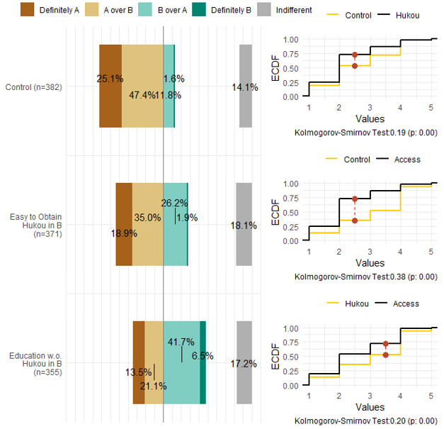

This project asks how citizens arrive at the political views they hold, and what follows once they hold them. 
We investigate the construction of political interest, identity, and recognition among today's citizens, their modes of political participation in the digital era, and the interplay between public attitudes, opinions, and the processes of politicization and modernization. 
This project is particularly concerned with the implications of public expression and involvement in sociopolitical matters for the individuals involved, as well as for society and the state at large. 

Pursuant to these interests, the research has spanned a variety of topics, including the reconstruction of identity amidst urbanization, the transformation of political identification into action, the arousal of public service motivation, corruption and public support, the judicial governance of migrant populations, and time governance in urban development.

本项目探究当代公民政治认知的形成机制及其行为后果。
我们研究了当代公民如何构建其政治兴趣、身份与认同，他们在数字化时代的政治参与方式，以及公众如何应对与影响政治化及现代化进程。
本项目特别关注公众在社会政治事件中的表达，以及政治社会参与对个人、社会以及国家层面的影响。

基于这一关切，项目涉及城镇化进程中的身份重构、政治认同向行动的转化、公共服务动机的激发、腐败与公众支持、流动人口的司法治理，以及城市发展中的时间治理等主题。

### Funding 项目资助

National Natural Science Foundation of China, Young Scientists Fund. *Social-Psychological Mechanisms of Identity Construction among Established and New Urban Residents in the New Urbanization, and Pathways for Policy Guidance* (72004109). 2021–2023. Principal Investigator.

国家自然科学基金青年项目：《新型城镇化进程中新老市民身份认同建构的社会心理机制与政策引导路径研究》（72004109），2021–2023年，主持，已结项。

Beijing Municipal Commission of Planning and Natural Resources. *A Study of Unauthorized Construction in Beijing* (1941STC62479). 2020–2021. Principal Investigator.

北京市规划和自然资源委员会委托项目：《北京市违法建设专题研究》（1941STC62479），2020–2021年，主持，已结项。

### Selected Publications 部分成果

胡悦和李睿哲：《政治认同的行动转化与基于荣誉表彰的塑造机制》，《政治学研究》2026年第4期，第190～211页。

王翔和胡悦：《约束与包容：流动人口司法治理的差异性研究》，《公共管理评论》2026年网络首发，第1～26页。

胡悦和邢羿飞：[《双向认知视角下新老市民群体的身份建构与行为治理研究》](https://doi.org/10.19648/j.cnki.jhustss1980.2026.04.07)，《华中科技大学学报（社会科学版）》2026年第40卷第4期，第63～73页。

胡悦、孙宇飞和陈子怡：[《扣动公心之弦：公共服务动机激发机制适用性与稳定性研究》](https://kns.cnki.net/KCMS/detail/detail.aspx?dbcode=CJFQ&dbname=CJFDAUTO&filename=GGZC202501006)，《公共管理与政策评论》2025年第1期，第54～71页。

Tang, Wenfang, and Yue Hu. 2023. [“Detecting Grassroots Bribery and Its Sources in China: A Survey Experimental Approach.”](https://doi.org/10.1080/10670564.2022.2071883) *Journal of Contemporary China* 32(140): 207–24. (Pre-print [available here](https://www.researchgate.net/publication/356834671_Detecting_Grassroots_Bribery_and_its_Sources_in_China_A_Survey_Experimental_Approach))

胡悦和李睿哲：[《城市治理的时间悖论与动态治理》](https://kns.cnki.net/kcms2/article/abstract?v=sf24_f5fySYkSZJMoV3xY4oJk6h4DJJzasTak5Lkg-gIQMcoJkwg0qzJzyvlOBqG8088XOLRQXftYX53IqHak3CkPrS5xORBfN0Xa4DeLoGiUYUyPSXTUBW9X1UPaZOozn5daCWJ46k=&uniplatform=NZKPT&language=CHS)，《南京大学学报（哲学·人文科学·社会科学）》2023年第60卷第6期，第96～111+159～160页。（《新华文摘》2024年第11期全文转载）

Pizzi, Elise, and Yue Hu. 2022. [“Does Governmental Policy Shape Migration Decisions? The Case of China’s Hukou System.”](https://doi.org/10.1177/00977004221087426) *Modern China* 48(5): 1050–79. (Pre-print [available here](https://www.researchgate.net/publication/353571706_Does_Governmental_Policy_Shape_Migration_Decisions_The_Case_of_China's_Hukou_System))

Claypool, Vicki Hesli, William M. Reisinger, Marina Zaloznaya, Yue Hu, and Jenny Juehring. 2018. [“Tsar Putin and the ‘Corruption’ Thorn in His Side: The Demobilization of Votes in a Competitive Authoritarian Regime.”](https://doi.org/10.1016/j.electstud.2018.06.001) *Electoral Studies* 54: 182–204. (Pre-print [available here](https://www.researchgate.net/publication/325717067_Tsar_Putin_and_the_corruption_thorn_in_his_side_The_demobilization_of_votes_in_a_competitive_authoritarian_regime))
