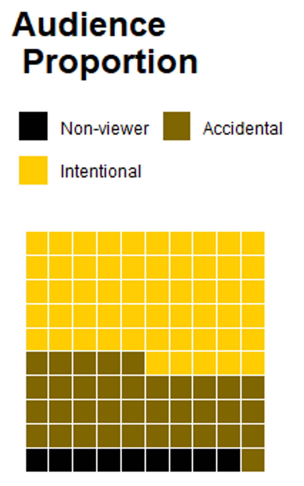

Individuals are not passive in their responses to the dominant cultural actions of their own and other countries. 
Despite appearing significantly weaker in the face of powerful state propaganda machinery, they retain sufficient agency to **identify** and **understand** political propaganda, and to some extent, **influence** its impact on themselves. 
We are particularly interested in how this process from the macro to the micro level is realized. 
This interest distinguishes our research team's perspective from the political communication and political socialization studies that focus primarily on the state side and commnicational paths.
Our work delves deeper into the receivers' responses, exploring their feelings, comprehension, and actions in response to political messages from the government. 
A fundamental yet complex question underpins this research: who constitutes the audience for the state authority (in media environment, formal and informal education, international society) and why?

人们对本国和他国的国家主导文化行为的反应不是被动的。
他们虽在强大国家宣传机器前显得十分弱小，但仍有足够的能动性来**识别**、**理解**政治宣传，并在一定程度上左右这些宣传对其自身的**影响**。
我们对这一宏观到微观过程是如何实现的特别感兴趣。
这使得我们团队的研究视角与专注于官方媒体内容和传播手段的政治传播研究产生了不同。
我们更关注人们如何对官媒进行响应，例如，当公众接触到政府的政治信息时，他们实际上感受到了什么，理解了什么，又采取了什么行动。
我们想了解，在互联网时代，谁是国家在媒体、教育、国际领域的受众，以及为什么。

### Selected Publications 部分成果

Hu, Yue, Yufei Sun, and Donald Lien. 2022. [“The Resistance and Resilience of National Image Building: An Empirical Analysis of Confucius Institute Closures in the U.S.”](https://www.researchgate.net/publication/359845059_The_Resistance_and_Resilience_of_National_Image_Building_An_Empirical_Analysis_of_Confucius_Institute_Closures_in_the_US) *Chinese Journal of International Politics* 15(3): Forthcoming. (Pre-print [available here](https://www.researchgate.net/publication/359845059_The_Resistance_and_Resilience_of_National_Image_Building_An_Empirical_Analysis_of_Confucius_Institute_Closures_in_the_US))

Jiang, Qiaolei, Shiyu Liu, Yue Hu, and Jing Xu. 2022. [“Social Media for Health Campaign and Solidarity Among Chinses Fandom Publics During the Covid-19 Pandemic.”](https://www.frontiersin.org/article/10.3389/fpsyg.2021.824377) *Frontiers in Psychology: Health Psychology* 12: 824377.

Hu, Yue, and Zijie Shao. 2022. [“What Drives Chinese Internet Users to Watch State-Media Broadcasts? An Audience Analysis.”](https://doi.org/10.1007/s11366-021-09756-1) *Journal of Chinese Political Science* 27(1): 19–40. (Pre-print [available here](https://www.researchgate.net/publication/353571814_What_Drives_Chinese_Internet_Users_to_Watch_State-Media_Broadcasts_An_Audience_Analysis))

Hu, Yue. 2020. [“Refocusing Democracy: The Chinese Government’s Framing Strategy in Political Language.”](https://www.tandfonline.com/doi/abs/10.1080/13510347.2019.1690461) *Democratization* 72(2): 302–20. (Pre-print [available here](https://www.researchgate.net/publication/337277653_Refocusing_democracy_the_Chinese_government's_framing_strategy_in_political_language))

Hu, Yue. 2019. [“Are Informal Education Facilities Effective Means for Generating Political Support? A Spatial Analysis.”](https://onlinelibrary.wiley.com/doi/full/10.1111/ssqu.12589) *Social Science Quarterly* 100(3): 701–24.

Tang, Wenfang, Yue Hu, and Shuai Jin. 2016. [“Affirmative Inaction: Language Education and Labor Mobility among China’s Muslim Minorities.”](https://www.tandfonline.com/doi/abs/10.1080/21620555.2016.1202753) *Chinese Sociological Review* 48(4): 346–66. (Pre-print [available here](https://www.researchgate.net/publication/308010441_Affirmative_Inaction_Education_Language_Proficiency_and_Socioeconomic_Attainment_Among_China's_Uyghur_Minority))

Hu, Yue. 2013. [“Institutional Difference and Cultural Difference: A Comparative Study of Canadian and Chinese Cultural Diplomacy.”](https://brill.com/view/journals/jaer/20/2-3/article-p256_11.xml) *Journal of American-East Asian Relations* 20(2–3): 256–68.

胡悦和欧阳睿：[《软实力与硬实力关系研究——基于网络分析的实证研究》](https://kns.cnki.net/kcms2/article/abstract?v=3Nyamzb2at7hMYG3SmAlpyloW_NvfOwUh9LY2lRJ__vjQNsnjfyhQ46p-qemiwl1eWEBgwkGUioPM8FzYW39JcoHDyGqMWXCGoV4yV0-3tVUS_0RROxt0g==&uniplatform=NZKPT)，《世界经济与政治》2023年第7期，第27-50+156-157页。

程同顺、胡悦：[《对外政策的文化道具——浅析文明冲突论的工具性》](https://kns.cnki.net/kcms/detail/detail.aspx?dbcode=CJFD&dbname=CJFD2010&filename=XXNT201002009&v=qqRDE%25mmd2BK%25mmd2F8maCjhRqamQy24y594BLoBshF93MAaD1F85IJfnYs9FU5tZ6bOIfKFJ5)，《学习论坛》 2010年第02期, 第33-37页
