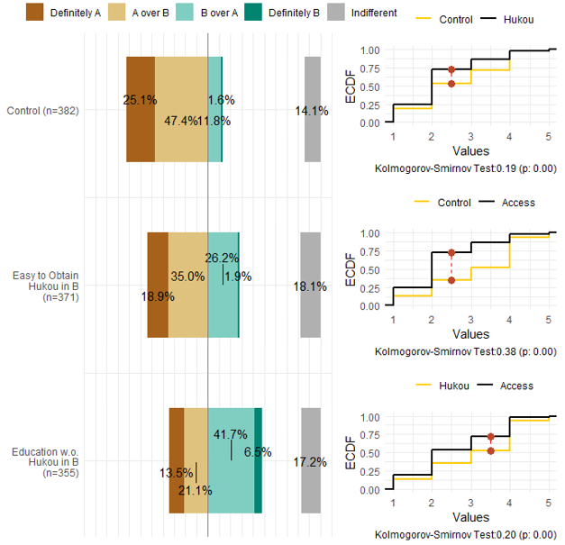

This project focuses on the structure of political engagements and their resonance within contemporary society. 
We investigate the construction of political interests and cognition among today's citizens, their modes of political participation in the digital era, and the interplay between public attitudes, opinions, and the processes of politicization and modernization. 
This project is particularly concerned with the implications of public expression and involvement in sociopolitical matters for the individuals involved, as well as for society and the state at large. 

Pursuant to these interests, the research has spanned a variety of topics, including the reconstruction of identity amidst urbanization, the dynamics between public opinion and democratization, corruption and public support, and time governance in urban development.

本项目探索当代社会政治卷入（参与意愿、偏好与行为等）。
我们研究了当代公民如何构建其政治兴趣和认知、他们在数字化时代政治参与方式，以及公众如何应对与影响政治化及现代化进程。
本项目特别关注公众在社会政治事件中的表达，以及政治社会参与对个人、社会以及国家层面的影响。
基于这一兴趣，项目涉猎了城市化进程中身份重构、公众意见与民主化、腐败与公众支持，以及城市化过程中的时间治理等多个主题。

### Selected Publications 部分成果

Hu, Yue, Yuehong Tai, and Frederick Solt. 2024. “Revisiting the Evidence on Thermostatic Response to Democratic Change: Degrees of Democratic Support or Researcher Degrees of Freedom?” *Political Science Research and Methods*: Forthcoming.(Pre-print [available here](https://osf.io/download/qpfsd/))

Tai, Yuehong, Yue Hu, and Frederick Solt. 2024. [“Democracy, Public Support, and Measurement Uncertainty.”](https://doi.org/10.1017/S0003055422000429) *American Political Science Review* 118(1): 512--528. (Pre-print [available here](https://osf.io/preprints/socarxiv/y5fdv/)) 

Tang, Wenfang, and Yue Hu. 2022. [“Detecting Grassroots Bribery and Its Sources in China: A Survey Experimental Approach.”](https://doi.org/10.1080/10670564.2022.207188) *Journal of Contemporary China* 32(140): 207–24. (Pre-print [available here](https://www.researchgate.net/publication/356834671_Detecting_Grassroots_Bribery_and_its_Sources_in_China_A_Survey_Experimental_Approach))

Pizzi, Elise, and Yue Hu. 2021. [“Does Governmental Policy Shape Migration Decisions?The Case of China’s Hukou System.”](https://journals.sagepub.com/doi/abs/10.1177/00977004221087426) *Modern China*: Online.  (Pre-print [available here](https://www.researchgate.net/publication/353571706_Does_Governmental_Policy_Shape_Migration_Decisions_The_Case_of_China's_Hukou_System))

Claypool, Vicki Hesli, William Reisinger, Marina Zaloznaya, Yue Hu, and Jenny Juehring. 2018. [“Tsar Putin and the ‘Corruption’ Thorn in His Side: The Demobilization of Votes in a Competitive Authoritarian Regime.”](https://dialnet.unirioja.es/servlet/articulo?codigo=6539661) *Electoral Studies* 54: 182–204. (Pre-print [available here](https://www.researchgate.net/publication/325717067_Tsar_Putin_and_the_corruption_thorn_in_his_side_The_demobilization_of_votes_in_a_competitive_authoritarian_regime))

胡悦和李睿哲: [《城市治理的时间悖论与动态治理》](https://kns.cnki.net/kcms2/article/abstract?v=sf24_f5fySYkSZJMoV3xY4oJk6h4DJJzasTak5Lkg-gIQMcoJkwg0qzJzyvlOBqG8088XOLRQXftYX53IqHak3CkPrS5xORBfN0Xa4DeLoGiUYUyPSXTUBW9X1UPaZOozn5daCWJ46k=&uniplatform=NZKPT&language=CHS)，《南京大学学报(哲学·人文科学·社会科学)》2023年第 60(6)期，第96-111+159-160页.
