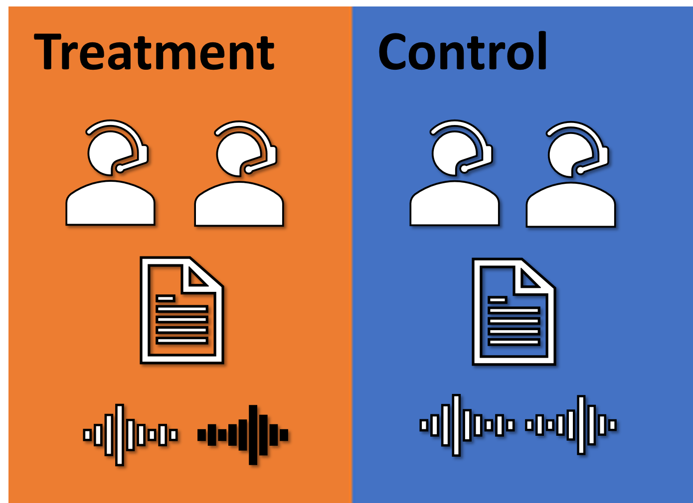

Language stands as a quintessential attribute of humanity. 
The enduring debate over whether language shapes thought or vice versa has captivated the greatest minds across history. 
Yet, the role of language in the political sphere remains underexplored.

Approaching from an empirical perspective, this project aims to uncover the impacts of linguistic relativity and language policy on the dynamics between government and the public, as well as on the formation and reformation of collective political consciousness.

语言是人类最根本的属性。
历史上，关于“是思维在塑造语言，还是语言塑造了思维”的争论一直吸引着众多伟大的理论家和科学家。
尽管如此，语言在政治领域的角色还远未被充分研究。
这一项目试图从实证角度拓展语言政治学研究领域，尤其注重探究语言相对论和语言政策对政府与民众互动关系以及集体政治认知的形成与重构的影响。

### The Book 专著

Hu, Yue. 2026. [*From Mouth to Mind: How China’s Language Regime Shapes Mass Political Psychology*](https://doi.org/10.1007/978-981-95-1849-4). Contributions to Political Science. Singapore: Springer Nature. ([About the book 本书简介](/publication/book-from-mouth-to-mind/))

The monograph gathers a decade of this project into one argument. It traces how a state's language regime reaches into the political minds of the people who live under it, running from the words officials choose, through the tongues citizens learn and speak, to the trust, identity, and policy preferences they end up holding.

《从口到心》是本项目阶段性的总结。全书追溯国家语言制度如何自上而下地进入民众的政治心理：从官方话语的措辞选择，到民众习得与使用的语言，再到他们最终持有的政治信任、身份认同与政策偏好。

### Selected Publications 部分成果

胡悦：[《政治认知的语言效应与机制》](https://doi.org/10.16499/j.cnki.1003-5397.2025.03.011)，《语言文字应用》2025年第3期，第34～49页。

Hu, Yue, Yuehong Cassandra Tai, Hyein Ko, Byung-Deuk Woo, and Frederick Solt. 2025. [“An Incomplete Recipe: One-Dimensional Latent Variables Do Not Capture the Full Flavor of Democratic Support.”](https://doi.org/10.1177/20531680251341857) *Research & Politics* 12(2). (Pre-print [available here](https://fsolt.org/papers/hutaikowoosolt2023_pre))

Hu, Yue, Yuehong Cassandra Tai, and Frederick Solt. 2025. [“Revisiting the Evidence on Thermostatic Response to Democratic Change: Degrees of Democratic Support or Researcher Degrees of Freedom?”](https://doi.org/10.1017/psrm.2024.16) *Political Science Research and Methods* 13(1): 237–43. (Pre-print [available here](https://osf.io/download/qpfsd/))

Tai, Yuehong Cassandra, Yue Hu, and Frederick Solt. 2024. [“Democracy, Public Support, and Measurement Uncertainty.”](https://doi.org/10.1017/S0003055422000429) *American Political Science Review* 118(1): 512–18. (Pre-print [available here](https://osf.io/preprints/socarxiv/y5fdv/))

Hu, Yue, and Elise Pizzi. 2022. [“Breaking through the Language Barrier: The Role of Language Policy in Migration Decisions.”](https://doi.org/10.1353/chn.2022.0022) *China: An International Journal* 20(3): 23–51.

胡悦和朱萌：[《以语塑心与国民治理：外语习得对政治认知能力的塑造机制研究》](https://doi.org/10.15944/j.cnki.33-1010/d.2022.04.007)，《治理研究》2022年第38卷第4期，第51～65+125页。

Hu, Yue. 2020a. [“Culture Marker Versus Authority Marker: How Do Language Attitudes Affect Political Trust?”](https://doi.org/10.1111/pops.12646) *Political Psychology* 41(4): 699–716. (Pre-print [available here](https://www.researchgate.net/publication/338460629_Culture_Marker_Versus_Authority_Marker_How_Do_Language_Attitudes_Affect_Political_Trust))

———. 2020b. [“Refocusing Democracy: The Chinese Government’s Framing Strategy in Political Language.”](https://doi.org/10.1080/13510347.2019.1690461) *Democratization* 27(2): 302–20. (Pre-print [available here](https://www.researchgate.net/publication/337277653_Refocusing_democracy_the_Chinese_government's_framing_strategy_in_political_language))

Hu, Yue, and Amy H. Liu. 2020. [“The Effects of Foreign Language Proficiency on Public Attitudes: Evidence from the Chinese-Speaking World.”](https://doi.org/10.1017/jea.2019.41) *Journal of East Asian Studies* 20(1): 1–23.

Tang, Wenfang, Yue Hu, and Shuai Jin. 2016. [“Affirmative Inaction: Education, Language Proficiency, and Socioeconomic Attainment among China’s Uyghur Minority.”](https://doi.org/10.1080/21620555.2016.1202753) *Chinese Sociological Review* 48(4): 346–66.
