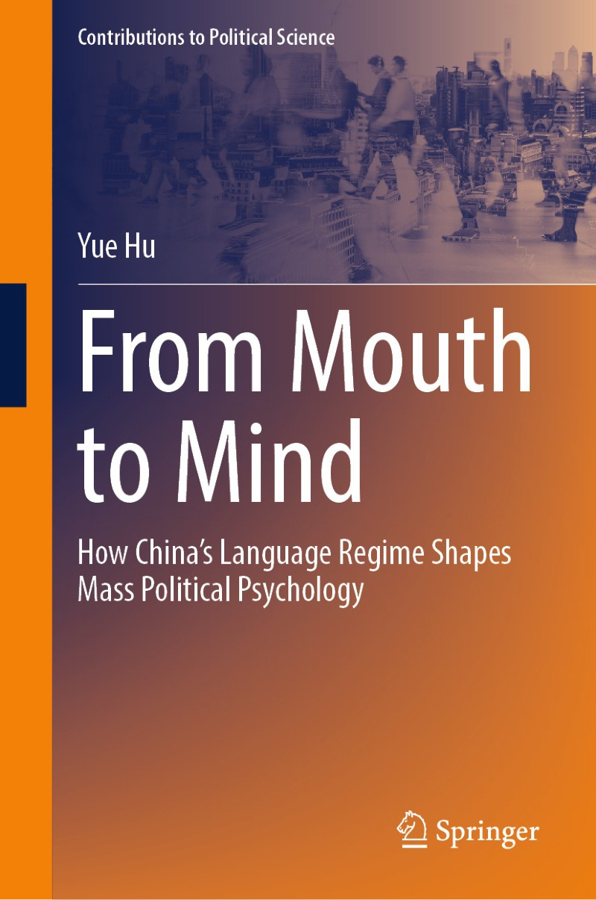

**Hu, Yue**. 2026. [*From Mouth to Mind: How China's Language Regime Shapes Mass Political Psychology*](https://doi.org/10.1007/978-981-95-1849-4). Contributions to Political Science. Singapore: Springer Nature. ISBN 978-981-95-1848-7 (print), 978-981-95-1849-4 (online).

## About the Book 内容简介

Governments in multilingual states decide which language counts as official, how much room dialects keep in public life, and which foreign language citizens are taught. 
This book asks what those decisions do to the political minds of the people who live under them.

The argument rests on a framework I call the *official language field*. 
A language carries political weight not because of what it says, but because of where the state has placed it. 
Within such a field, three capacities shape how a citizen understands and judges the government: the capacity to receive official messages, the capacity to speak in the official tongue, and the capacity one holds relative to everyone else. 
Each pushes political cognition in a different direction.

Evidence comes from four settings inside a single country. 
First, experiments and surveys gauge how listeners respond to officials who speak Mandarin rather than the listener's own dialect. 
Second, survey data on domestic migrants trace what dialect use does to identity and to the choice of where to settle. 
Third, a study of English users in China examines how a foreign language opens an alternative channel of political information. 
Finally, a corpus of more than a million *People's Daily* articles pins down where China's discourse about democracy came from and how the state has reframed it.

Taken together, the chapters move the study of language and politics from what gets said to the conditions under which it is said.

在多语言国家中，政府决定哪一种语言成为官方语言、方言在公共生活中还能占据多少空间、国民又应当学习哪一门外语。
本书要回答的是：基于政治的语言体系如何塑造生活于其中的国民的政治心理。

本书构建了“官方语言场域”（official language field）框架。
语言之所以具有政治意涵，往往不在于它说了什么，而在于国家把它放在了什么位置。
在一个官方语言场域中，三种能力共同塑造着社会成员对政府的认知与判断：接收官方信息的能力、以官方语言表达自身的能力，以及相对于他人所处的能力位置。
三者作用方向不同，程度也不同。

## Contents 目录

1. The Political Linguistics of the Chinese Language Regime (pp. 1–14)
2. The Official Language Field in China: A Data-Based Overview (pp. 15–23)
3. How an Official Language Shapes Mindsets: The Effects (pp. 25–45)
4. How an Official Language Shapes Mindsets: A Mechanism (pp. 47–65)
5. How the Dialect Use Shapes Mindsets: A Case of Domestic Migration (pp. 67–88)
6. How the Foreign Language Learning Shapes Mindsets: A Study of English Users in China (pp. 89–108)
7. How the Reading-Writing System Shapes Mindsets: A Source Analysis of the Democracy Discourse (pp. 109–127)
8. Governing the Tongue: A Preliminary Conclusion (pp. 129–137)

[← Back to Publications 返回发表列表](/publication/)
