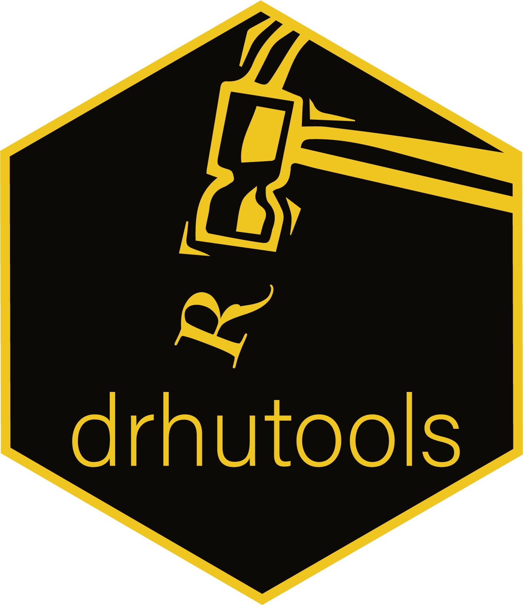

A toolbox for writing an academic paper with rmarkdown. The tools includes data analyses, visualization, and documenting.

To install:

* the latest released version: `install.packages("drhutools")`.
* the latest developing version: `remotes::install_github("sammo3182/drhutools")`.
