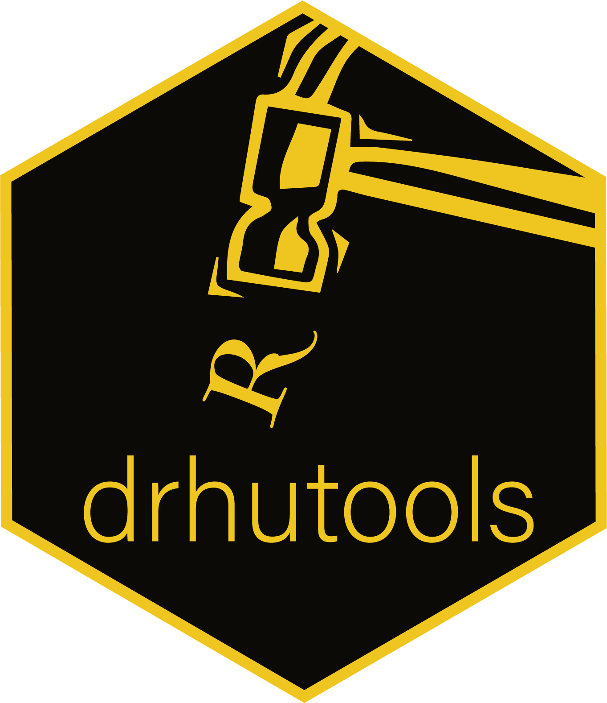

**Hu, Yue**, Qian Qiu, and Wen Deng. 2026. drhutools: Political Science Academic Research Gears. R package version 1.1.1. The Comprehensive R Archive Network (CRAN).

 
 

A toolbox for writing an academic paper with rmarkdown. The tools include data analyses, visualization, and documenting.

To install:

* the latest released version: `install.packages("drhutools")`.
* the latest development version: `remotes::install_github("sammo3182/drhutools")`.
