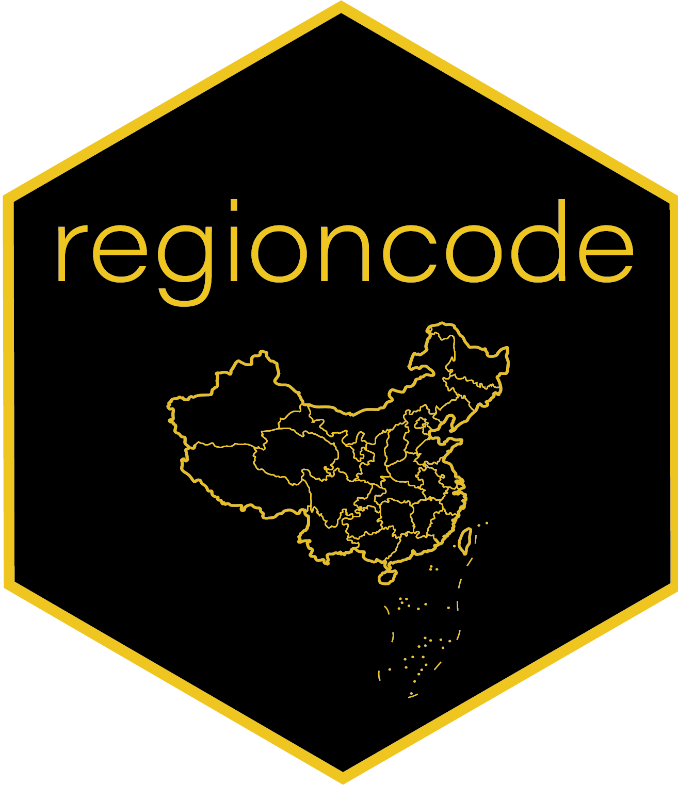

**Hu, Yue**, Xinyi Ye, Qian Qiu, Yufei Sun, and Wenquan Wu. 2026. regioncode: Convert Region Names and Division Codes of China over Years. R package version 0.2.1. The Comprehensive R Archive Network (CRAN).

 
 

Inspired by Vincent Arel-Bundock's well-known [`countrycode`](https://joss.theoj.org/papers/10.21105/joss.00848), we created `regioncode` to achieve similar functions specifically for China studies. `regioncode` enables seamlessly converting regions' formal names, commonly used names, and administrative division codes between each other.

To install:

* the latest released version: `install.packages("regioncode")`.
* the latest development version: `remotes::install_github("sammo3182/regioncode")`.

For more details, check out [the vignette](https://cran.r-project.org/web/packages/regioncode/vignettes/regioncode-vignette.html)
